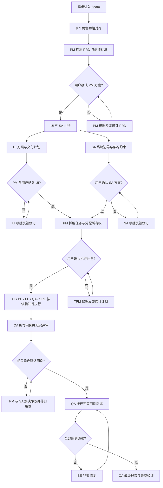

# Codex Virtual R&D Team

一套面向 Codex 的虚拟研发团队配置。它通过可复用 Skills 识别用户指令，通过真实的自定义 Agents 承担 PM、架构、设计、开发、测试与运维职责，并提供 Meeting Room 插件用于多角色会议。

> 这套配置要求当前 Codex 运行环境支持自定义 Agents 和多 Agent 协作。所有角色都由真实子 Agent 执行，主 Agent 只负责编排、上下文传递、检查点控制与结果汇总，不模拟任何团队角色。

## 包含内容

```text
.
├── .agents/plugins/marketplace.json  # 仓库级插件市场
├── agents/rd-team/                   # 8 个真实角色 Agent
├── plugins/meeting-room/             # 会议室插件
└── skills/                           # 团队、路由及单角色入口 Skills
```

| 角色 | 职责 |
| --- | --- |
| PM | 需求澄清、PRD、版本范围、验收标准与产品决策 |
| SA | 系统边界、架构方案、数据与并发风险、技术约束 |
| TPM | 技术拆解、任务分工、依赖关系、执行顺序与 Code Review |
| UI | 视觉方向、页面设计、切图、设计标注与 FE 交付契约 |
| BE | 后端业务、API、持久化、性能与后端测试 |
| FE | 页面实现、组件与状态、接口联调、前端测试与构建 |
| QA | 测试方案、用例评审、执行、缺陷反馈、回归与质量报告 |
| SRE | CI/CD、部署、可观测性、可靠性、回滚与发布准备 |

`rd-team-routing` 是团队内部的统一路由 Skill。它负责选择最小安全角色集合、建立契约门禁、判断复杂实施是否需要文件化计划，并统一 `.rd-team/` 产物结构。通常不需要由用户直接调用。

## 安装

### 1. 克隆仓库

```bash
git clone https://github.com/xiaok0928/codex-virtual-rd-team.git
cd codex-virtual-rd-team
```

### 2. 安装团队 Skills 和 Agents

```bash
CODEX_HOME="${CODEX_HOME:-$HOME/.codex}"
mkdir -p "$CODEX_HOME/skills" "$CODEX_HOME/agents/rd-team"
cp -R skills/. "$CODEX_HOME/skills/"
cp -R agents/rd-team/. "$CODEX_HOME/agents/rd-team/"
```

如果目标目录中已经存在同名配置，请先自行备份并确认差异。Agent 配置默认使用 `gpt-5.5`；若你的 Codex 环境没有该模型，请修改 `agents/rd-team/*.toml` 中的 `model` 字段为当前可用模型。

从旧版本升级时，路由已经由 `agents/rd-team/routing.toml` 迁移到 `skills/rd-team-routing/`。确认旧文件没有自定义内容后，可删除安装目录中遗留的 `agents/rd-team/routing.toml`，避免同时加载两套路由规则。

复制完成后重启 Codex，并新建一个任务，使 Skills 和 Agents 重新加载。

### 3. 安装 Meeting Room 插件

将本仓库添加为插件 marketplace：

```bash
codex plugin marketplace add xiaok0928/codex-virtual-rd-team
codex plugin marketplace list
```

随后重启 ChatGPT 桌面应用，在 Codex 的 **Plugins** 中选择 **Codex Virtual R&D Team**，安装并启用 `meeting-room`，再新建任务进行测试。

Codex 官方文档说明了 `.codex-plugin/plugin.json`、仓库级 `.agents/plugins/marketplace.json` 以及 `codex plugin marketplace add` 的用法，参见 [Build plugins](https://learn.chatgpt.com/docs/build-plugins)。

## 快速使用

所有指令都应放在消息开头，后面直接跟任务内容。

```text
/team 为设备管理平台增加巡检计划功能，包含 Web 管理端和后端接口。
```

```text
/BF 为用户列表增加按状态筛选，完成前后端实现和验证。
```

```text
/BE 修复订单重复提交时的幂等问题。
```

```text
/Meeting-room 召集 PM、SA、TPM 和 QA，评审批量导入方案。
```

## 团队指令

| 指令 | 适用场景 | 执行方式 |
| --- | --- | --- |
| `TEAM` 或 `/team` | 完整需求、跨角色或高风险交付 | 启动完整研发团队并经过 PM、UI/SA、TPM 和 QA 检查点 |
| `/BF` | 边界清晰的小型前后端需求 | BE 与 FE 先确认 API 契约，再并行开发 |
| `/PM` | PRD、范围、验收标准、产品决策 | 仅启用 PM Agent |
| `/SA` | 架构设计、系统边界、技术风险 | 仅启用 SA Agent |
| `/TPM` | 技术拆解、任务分工、实现评审 | 仅启用 TPM Agent |
| `/UI` | 页面设计、视觉规范、切图与交付标注 | 仅启用 UI Agent |
| `/BE` | 后端实现、API、数据访问或后端缺陷 | 仅启用 BE Agent |
| `/FE` | 前端页面、组件、状态或接口集成 | 仅启用 FE Agent |
| `/QA` | 测试设计、回归、质量验收 | 仅启用 QA Agent |
| `/SRE` | 部署、流水线、监控、可靠性与回滚 | 仅启用 SRE Agent |
| `/Meeting-room` | 多角色讨论、评审与决策 | 启动 Meeting Room 插件并创建真实参会 Agents |

`/BF` 会通过 `rd-team-routing` 选择最小安全路线。除了 `backend_only_small`、`frontend_only_small` 和 `fullstack_small`，路由层还支持 `ui_only_small`、`ui_frontend_small`、`product_unclear`、`architecture_risk`、`testing_risk`、`sre_risk` 和 `large_cross_module`。只有风险或规模确实需要时才增加角色。

路由规则遵循三个原则：选最小安全角色集、先确认共享契约再并行、验证范围与变更风险相匹配。

## TEAM 工作流程



关键门禁：

1. PM 先明确当前版本范围、非目标和验收标准。
2. 有界面时，UI 交付先由 PM 审核，再由用户确认。
3. FE 开始页面实现前，UI 与 FE 必须确认设计契约。
4. 前后端联调前，BE 与 FE 必须确认 API 契约。
5. QA 用例必须经过相关角色评审；有争议时由 PM 和 SA 推动决策。
6. 测试、修复和回归循环持续到全部约定用例通过。

## Meeting Room

Meeting Room 用于讨论、评审和决策，不替代 `/team` 的交付流程。会议中的每位参与者都是一个真实 Agent，所有消息默认对当前全部参与者可见。

### 启动会议

```text
/Meeting-room 召集 PM、SA、BE 和 QA，决定库存扣减的一致性方案。
```

用户明确写出角色时按指定角色参会；未指定时，主持 Agent 会按主题选择最小必要角色集合。

### 会议控制指令

| 指令 | 作用 | 示例 |
| --- | --- | --- |
| `/补充 <内容>` | 增加共享背景并广播给所有参会者 | `/补充 峰值流量为每秒 5000 单` |
| `/暂停 [原因]` | 暂停新一轮讨论和决策 | `/暂停 等待业务数据` |
| `/继续 [内容]` | 恢复会议并同步新增内容 | `/继续 数据已确认` |
| `/纠正 <内容>` | 废止错误事实并要求受影响角色重算结论 | `/纠正 库存由仓库维度改为门店维度` |
| `/约束 <内容>` | 增加不可违反的硬约束 | `/约束 不允许引入新的中间件` |
| `/邀请 <ROLE...>` | 邀请并同步一个或多个真实 Agent | `/邀请 UI FE` |
| `/散会` | 结束会议、关闭 Agents 并输出会议纪要 | `/散会` |

会议状态只由以上斜杠指令改变。例如“暂停一下”只是普通会议内容，不会暂停；“邀请 UI 加入”也不会新增参会者，必须使用 `/邀请 UI`。

### 责任分配

- `@PM`、`@SA`、`@TPM`、`@UI`、`@BE`、`@FE`、`@QA`、`@SRE`：指定当前参会角色负责回应。
- `@all`：要求所有当前参会者回应。
- `@ROLE` 只分配责任，不邀请缺席角色；新增角色必须使用 `/邀请 ROLE`。
- 即使只指定一个角色，完整原消息仍会广播给全部当前参会者。

```text
@PM 明确是否允许部分成功；@SA 评估事务边界；@QA 补充失败场景。
```

## 产物目录

以下目录是虚拟团队的可移植默认值。目标项目已有文档目录、产物命名或交付记录规范时，以项目本地规范为准；没有本地规范时，不强制创建与当前任务无关的额外目录或记录。

每个任务使用一个根目录：

```text
<project-root>/.rd-team/<task_name>_<YYYYMMDD>/
```

角色、版本、共享文档和复杂任务计划均放在该根目录下：

```text
<task-root>/<ROLE>/
<task-root>/versions/<version>/<ROLE>/
<task-root>/documents/
<task-root>/planning-with-files/
```

`planning-with-files/` 只用于已确认的复杂、多阶段虚拟团队实施；PRD、架构讨论、咨询、文档任务、窄范围修改和普通单 Agent 工作不会强制启用。

`.rd-team/` 用于保存计划、讨论记录、报告和其他辅助产物。本仓库已经通过 `.gitignore` 忽略该目录。在其他 Git 项目中使用时，如果项目尚未忽略 `.rd-team/`，建议将它加入本地 `.git/info/exclude`，这样不会修改受版本控制的文件，也不会让运行产物进入业务代码提交；只有团队希望共享这条规则时才写入项目 `.gitignore`。

## 本地开发规范

开始开发前，各角色会优先检查目标项目的 `AGENTS.md`、贡献指南、工程文档、构建脚本、测试命令、设计系统、部署手册和其他本地规范：

- 项目存在本地规范时，以本地规范为准。
- 项目没有本地规范时，不因缺少特定 Skill、工具、目录或流程而阻塞，直接按现有代码风格和通用工程实践执行。
- 本仓库不要求用户安装作者个人使用的额外 Skill、代码检索工具或固定构建环境。

## 自定义

- 修改角色能力：编辑 `agents/rd-team/<role>.toml`。
- 修改团队流程：编辑 `skills/team/SKILL.md`。
- 修改角色路由与门禁：编辑 `skills/rd-team-routing/SKILL.md`。
- 修改单角色入口：编辑 `skills/<role>/SKILL.md`。
- 修改会议协议：编辑 `plugins/meeting-room/skills/meeting-room/SKILL.md`。
- 修改插件展示信息：编辑 `plugins/meeting-room/.codex-plugin/plugin.json`。

修改配置后重新复制对应目录、重启 Codex，并在新任务中验证。

## License

[MIT](LICENSE)

> 虚拟团队可以按需求规模灵活配置。小需求优先使用 `/BF` 等轻量协作方式即可，不建议为很小的需求启动完整 `/team`：完整团队流程耗时更长，也会消耗更多 Token。
